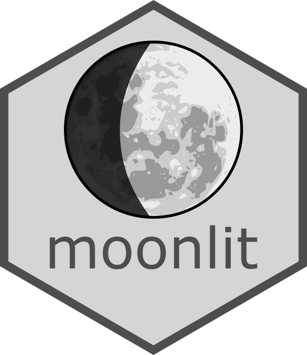

<p align="center">
  
</p>

# moonlit: R package to estimate moonlight intensity for any given place and time (v 0.1.0)


(c) Michał Śmielak 2021  
Avaiblabe under GNU General Public License version 3


## Introduction

Moon phase is often used to represent lunar illumination as an environmental niche, but it is a poor proxy for actual moonlight intensity on the ground. A model is therefore proposed to estimate lunar illumination for any given place and time. The model is shown to provide a significantly better prediction of empirically measured lunar illumination than moon phase. Importantly, it also has much higher temporal resolutions, allowing to not only detect selectiveness for light levels between nights but also within each night, which is not achievable with moon phase alone. This offers unprecedented opportunities to study complex activity patterns of nocturnal species using any time-stamped data (GPS trackers, camera traps, song meters, etc.). It can also be applied to historical datasets, as well as facilitate future research planning in a wide range of ecological and behavioural studies.


## Description

`moonlit` is an R package providing biologically meaningful moonlight measures. It allows researchers to study ecological and behavioral effects of changing moonlight intensity. Unlike simple moon phase calculations, `moonlit` accounts for various factors affecting ground illumination, including the moon's position, atmospheric extinction, and twilight effects. Importantly, it can calculate moonlight intensity values any interval.

This package is particularly useful in determining preference towards high or low illumination levels across different temporal scales (night, lunar cycle, seasons, years), offering a significant improvement over traditional moon phase-based analyses.

## Citation
If you use `moonlit` package in your research, please cite:

> Śmielak, M.K. Biologically meaningful moonlight measures and their application in ecological research. Behav Ecol Sociobiol 77, 21 (2023). https://doi.org/10.1007/s00265-022-03287-2


## Currently working functionalities:

- [x] Predicting moonlight intensity on the ground for any given place and time
- [x] Predicting twilight illumination levels 
- [x] Calculating nightly mean illumination levels for a given location (particularly useful to determine moonlight preferences using time stamped species detections)
- [ ] Estimating extinction coefficient for a given elevation asl (__experimental - use with caution__)


## Using the moonlit library
### Installing
To install from github you need devtool package

```R
#install and load devtools
install.packages("devtools")
library(devtools)

#install moonlit library from github repo
install_github("msmielak/moonlit")

#load the moonlit library
library(moonlit)
```

### Functions
---

#### calculateMoonlightIntensity()


```R
calculateMoonlightIntensity(lat, lon, date, e)
```
Function requires as an input a matrix of values for location and date and a value of extinction coefficient *e*.  
Accepted formats:

* lat - latitude, numerical decimal
* lon - longitude, numerical decimal
* date - date time as POSIXct with the local time zone. If needed use as.POSIXct(date, tz=timezone)
* e - extinction coefficient - a single numerical value depending on the altitude. Average extinction coefficients (magnitude per air mass) are as follows:
  - At sea level: 0.28
  - At 500m asl: 0.24
  - at 1000m asl: 0.21
  - at 2000m asl: 0.16

Function returns a data frame with following columns:

* **night** - a logical value, true when sun below the horizon for given date and location
* **sunAltDegrees** - solar altitude in degrees; this can be used to subset "true" night observations
* **moonlightModel** - predicted moonlight illumination, relative to an "average" full moon
* **twilightModel** - predicted twilight illumination in lx; this is a crude approximation based solely on the position of the sun, so use with caution.
* **illumination** - combined moon and twilight intensity, in lx. Moonlight converted to lx based on average full moon value of 0.32 lx.
* **moonPhase** - lunar phase in numerical value - % of moon face illuminated

It will also conveniently plot predicted values as points and moon phase as line, allowing for quick visual comparison of the two measures.

> [!NOTE]
> Currently it assigns 0 when sun is above the horizon, even if the moon is visible. Normally, this is not a problem, becasue when sun is visible, moonlight is negligible in comparison.
> If you want to calculate of moonlight intensity during the day it is not possible using this function and would require a custom approach.
---
#### calculateMoonlightStatistics()
```R
calculateMoonlightStatistics(lat, lon, date, e, t, timezone)
```

This function calculates **nightly** statistics for moonlight illumination and moon phase.

**Note: statistics can only be calculated when there is both sunrise and sunset on the night you are analysing. This is usually not an issue but during polar summer or winter there might not be a sunrise and sunset. If that is the case in your data, for now, you will need to remove these nights from your dataset manually. If in doubt or if you are getting "Error in seq.int(0, to0 - from, by) : 'to' must be a finite number", use sunrise() and sunset() functions from the package suncalc to check if that is the case**

For each record it will assing min, max and mean values for the night. For diurnal records, the **nearest** night is assigned, so for records before noon it returns statistics for the night that starts on the previous day, and for records after noon it assigns statistics for the night that starts on this day.

Function requires as an input a matrix of values for location and date, local time zone and a value of extinction coefficient *e*.  
Accepted formats: 

* lat - latitude, numerical decimal
* lon - longitude, numerical decimal
* date - date time as POSIXct with the local time zone. If needed use as.POSIXct(date, tz=timezone)
* e - extinction coefficient - the same as the main function, for instance, 0.26
* t - sampling interval -  15 minutes is more than enough, can go down to 1 hour for large datasets to save time.
It is used in seq() function so the same values are accepted: A character string, containing one of "sec", "min", "hour". This can optionally be preceded by a (positive or negative) integer and a space, or followed by "s". Example: "15 mins", "3 hour" etc.
* timezone - time zone of the data - usually in the format "Continent/City", i.e. for Poland: "Europe/Warsaw"  
**Note: timezone variable is a workaround for errors appearing when calculating mean values. At some point in the process time zone information is lost, leading to errors. When I manage to locate the source of that error it can be removed. For now, this function should only be applied to data with common time zone. If your data is split betwen multiple time zones you will need to run this function separately for each time zone**


Function returns a data frame with following columns:

*	**sunset** and **sunrise** – time of sunset and sunrise between which the mean value is calcuated 
* **meanMoonlightIntensity** - mean value of modeled illumination for the night
* **minMoonlightIntensity** - min value of modeled illumination for the night
* **maxMoonlightIntensity** - max value of modeled illumination for the night
* **meanMoonPhase** - mean value of moon phase (% of moon illuminated)
* **minMoonPhase** - min value of moon phase (% of moon illuminated)
* **maxMoonPhase** - max value of moon phase (% of moon illuminated)

> [!NOTE]
> Statistics can only be calculated when there is both sunrise and sunset on a given night. This is usually not an issue but during polar summer or winter there might not be a sunrise and sunset. If that is the case in your data, for now, you will need to remove these nights from your dataset manually. If in doubt or if you are getting "Error in seq.int(0, to0 - from, by) : 'to' must be a finite number", use sunrise() and sunset() functions from the package suncalc to check if that is the case.

---
#### elevExtCoeff()
```R
elevExtCoeff(elev)
```
> [!CAUTION]
> Still under development and my produce wrong results. For the moment it is recommended to use preset e values as listed in the main function.
> Once properly tested this function will be incorporated in the main model

This function calculates an extinction coefficient based on the observer's elevation and requires a single parameter:
* **elev** - elevation in metres above sea level, numerical

The impact on the overall moonlight intensity estimates is limited, therefore for sites that share similar elevations a nearest sample value is recommended for all calculations as described in calculateMoonlightIntensity().

When comparing sites with significant difference in altitude this function can be used to estimate extiction coefficient more precisely, although at the moment calculateMoonlightIntensity() function only takes a single value so model should be applied to each site separately.

In the future the main function can be amended to take in a separate column with elevation asl and this fuction will be used to calculate extinction coefficient automatically for each record.

Extinction coefficient calculatios are based on peak lunar irradiance of around 560 nm (Veilleux & Cummings, 2012  https://doi.org/10.1242/jeb.071415). Aerosol Optical Depth (AOD) is assumed to be 0.15, an average value.


---
## Examples

```R
library(moonlit)

# Calculate moonlight intensity in Warsaw on 15/10/2023 at 22:00

lat <- 52.2297
lon <- 21.0122
date <- as.POSIXct("2023-10-15 22:00:00", tz = "Europe/Warsaw")
result <- calculateMoonlightIntensity(lat, lon, date, e = 0.26)

# Calculate nightly statistics for the entire night starting on 15/10/2023

stats <- calculateMoonlightStatistics(lat, lon, date, e = 0.26, t = "15 mins", timezone = "Europe/Warsaw")
```

## Disclaimer

While this package has been thoroughly tested and is based on peer-reviewed research, users should always validate results for their specific use cases. If you have any questions, concerns, or would like assistance applying this package to your data, please feel free to contact the author directly.

